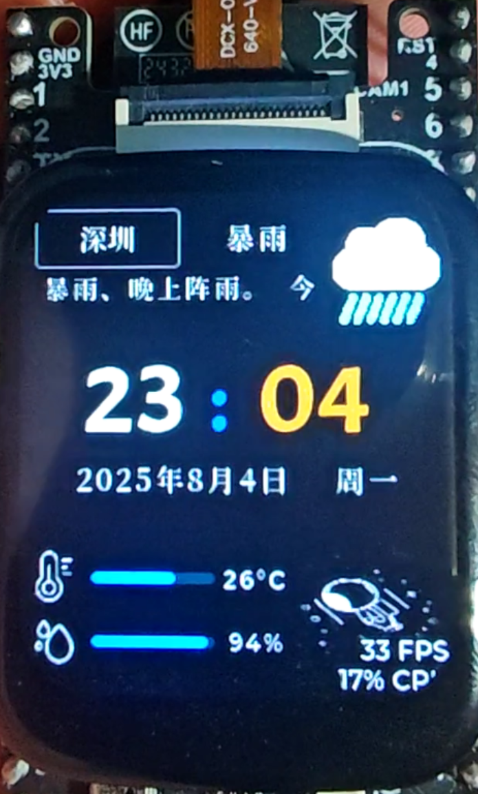
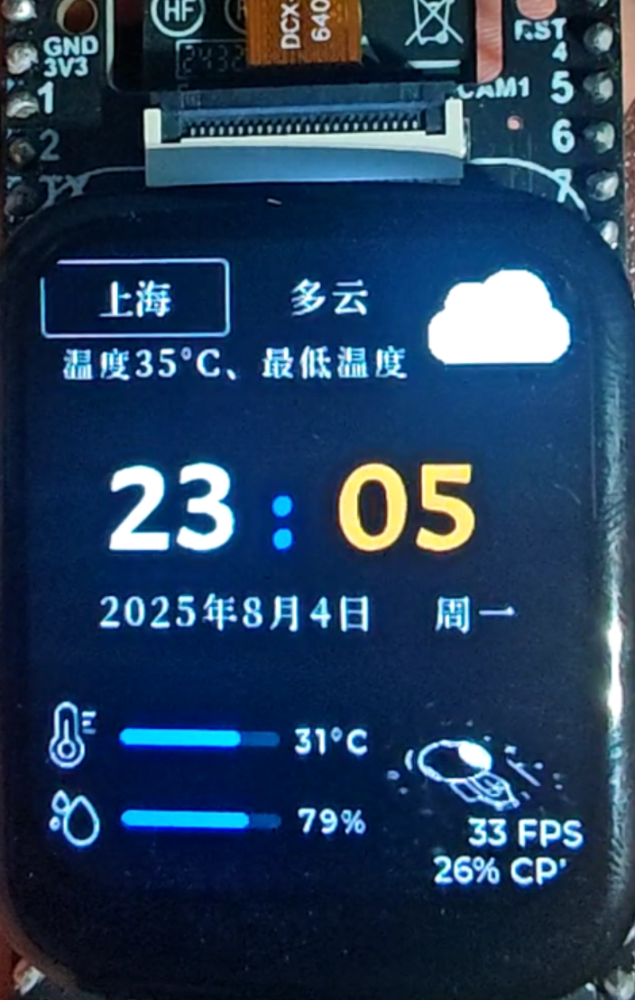
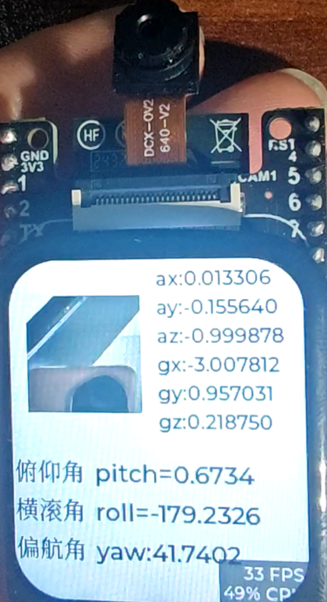
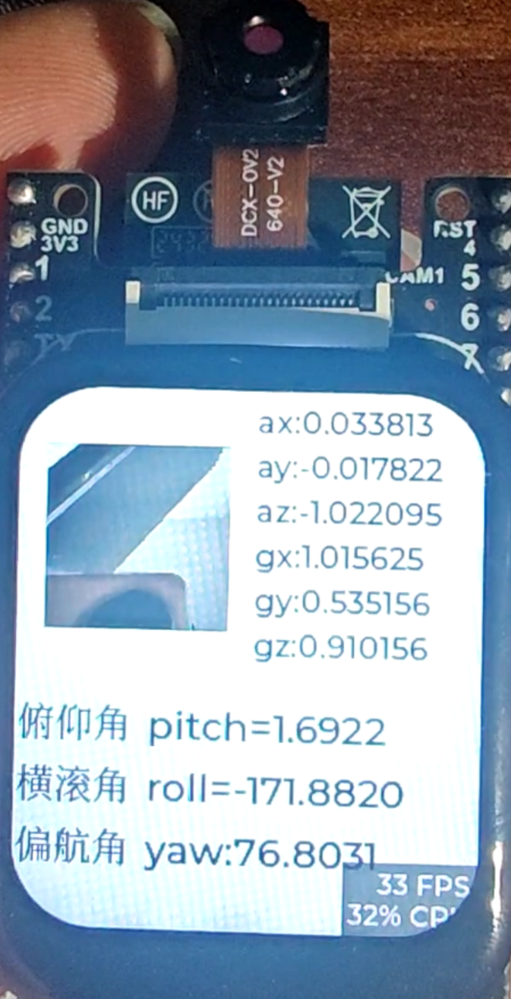
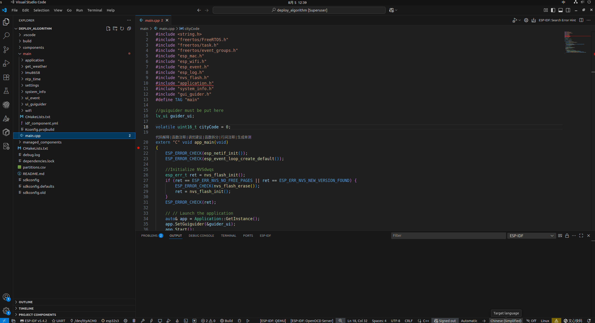

# ESP32WeatherClock

|||
|:---|:---|
|||

## 关于项目

一直做软件算法，感觉有点虚无，生活略感枯燥，于是想做点硬件项目，增加点乐趣，顺便学点关于esp32、lvgl、摄像头、显示屏、IMU、wifi、guiguider等相关知识。

本项目是一个简单的天气时钟案例，可以显示当前时间、温度、湿度、天气状态等信息，另外可以显示摄像头拍摄的画面、QMI8658传感器采集的姿态信息。

code：[https://github.com/laoxue888/ESP32WeatherClock](https://github.com/laoxue888/ESP32WeatherClock)

update：

- [2025-8-5:☔暴雨宅家无聊？用ESP32做个超实用天气时钟！](https://www.bilibili.com/video/BV1BGtEzNEEW/?spm_id_from=333.1387.homepage.video_card.click&vd_source=3bf4271e80f39cfee030114782480463)


## 开发环境

- ESP-IDF v5.5
- LVGL v8.3
- Ubuntu 24.04
> 注意：不用管理员身份运行vscode



```shell
# 配置让用户可用usb的权限
sudo usermod -aG dialout user	//user替换为自己的用户名
reboot							//要重启一下才生效
```


## 参考项目

- [https://github.com/78/xiaozhi-esp32](https://github.com/78/xiaozhi-esp32)
- [https://docs.lvgl.io/8.3/examples.html](https://docs.lvgl.io/8.3/examples.html)
- [https://download.csdn.net/download/gpio_01/89492825](https://download.csdn.net/download/gpio_01/89492825)
